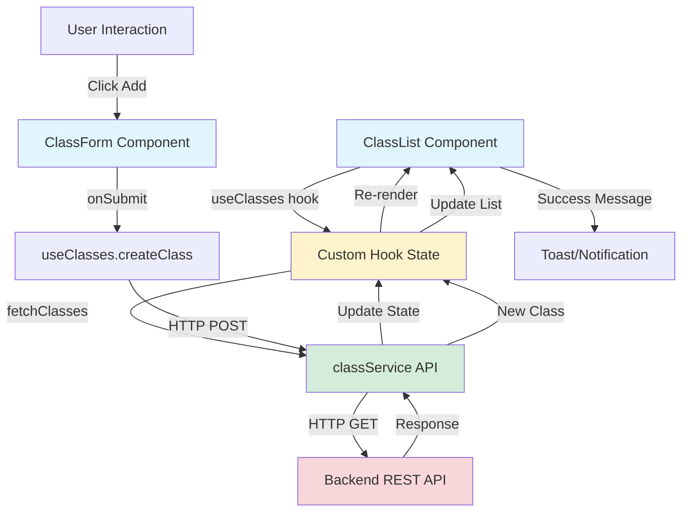
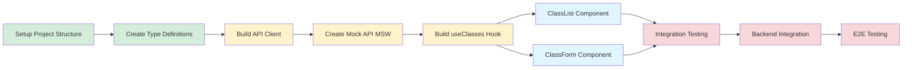
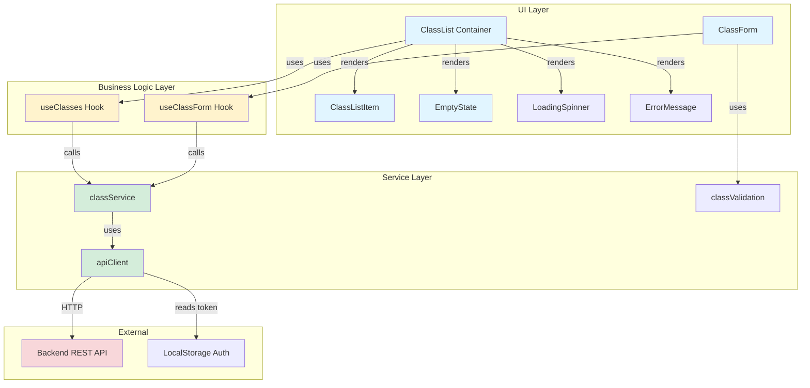
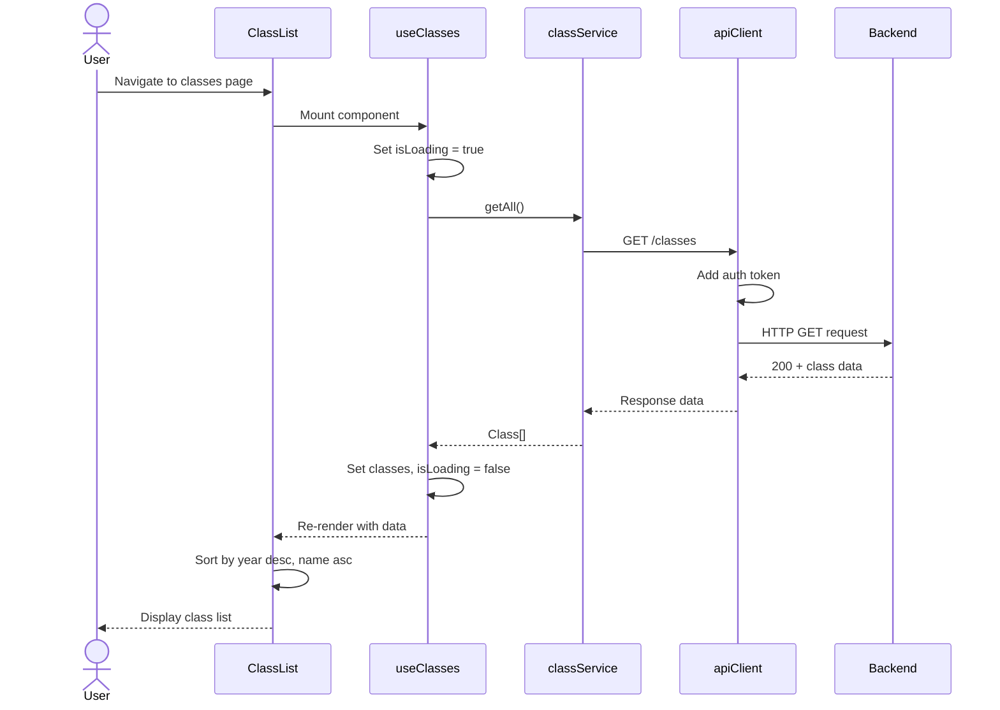
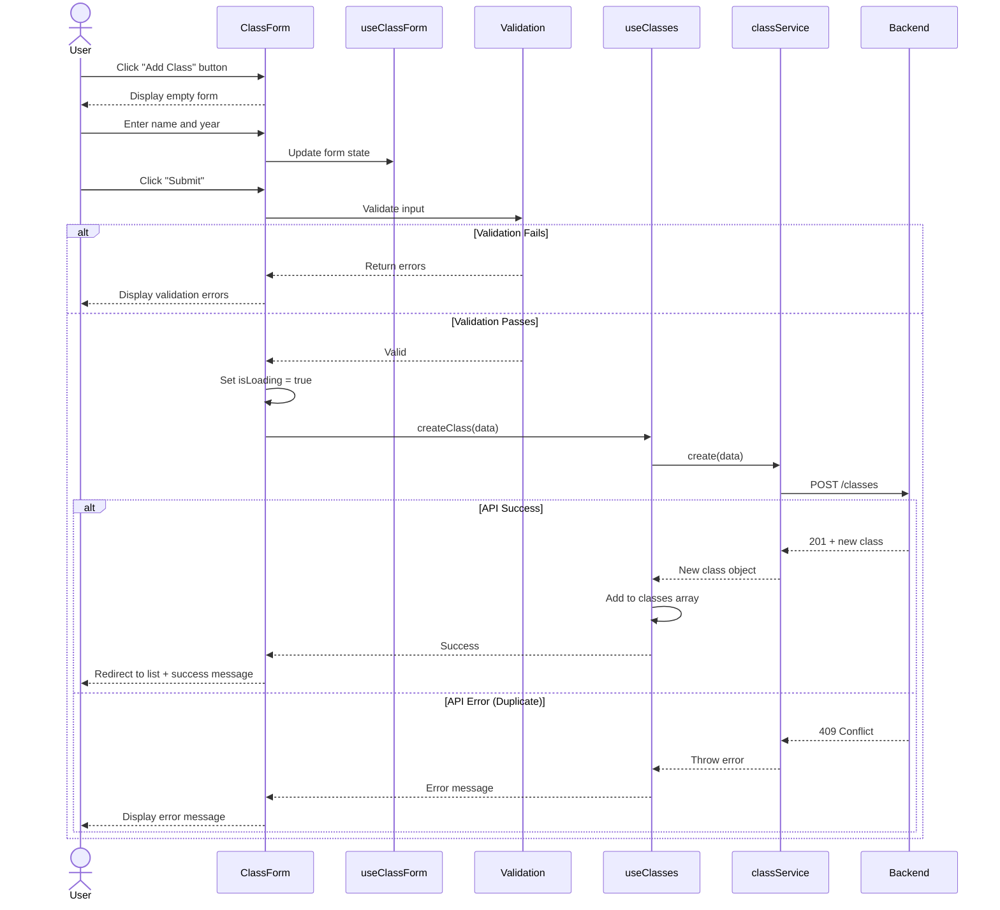
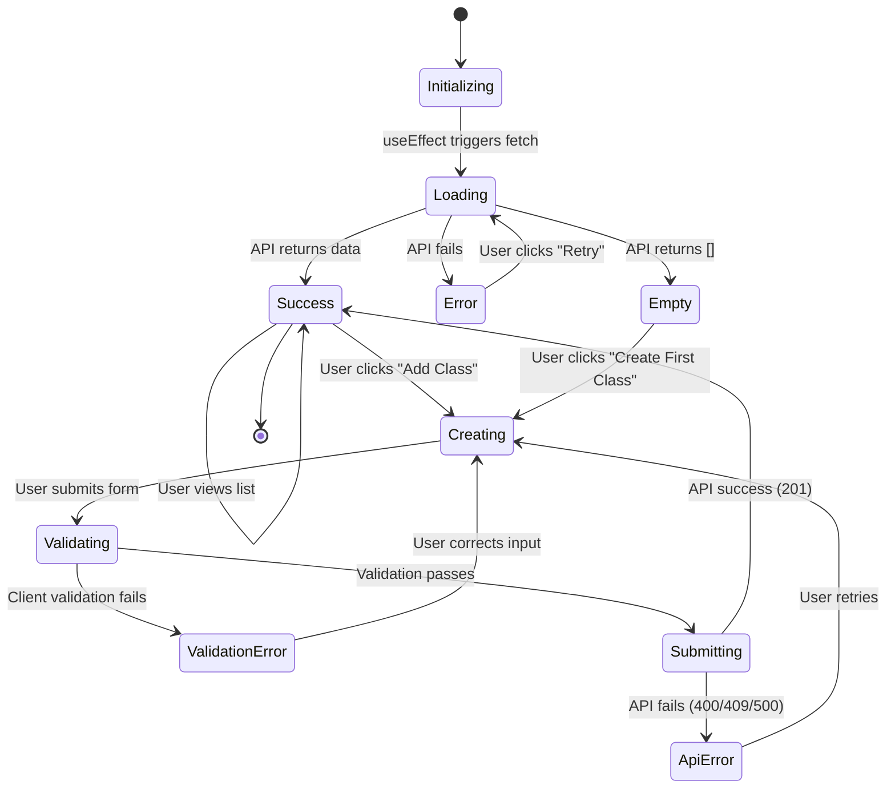

# Technical Design: Class Management Feature

**Version:** 1.0.0
**Created:** 2025-10-17
**Author:** System Architect
**Status:** APPROVED FOR IMPLEMENTATION

---

## Table of Contents

1. [Component Architecture](#1-component-architecture)
2. [REST API Specification](#2-rest-api-specification)
3. [Data Flow & State Management](#3-data-flow--state-management)
4. [Technical Risks & Dependencies](#4-technical-risks--dependencies)
5. [Architecture Diagrams](#5-architecture-diagrams)
6. [Security Considerations](#6-security-considerations)
7. [Performance Considerations](#7-performance-considerations)
8. [Testing Strategy](#8-testing-strategy)
9. [Deployment Checklist](#9-deployment-checklist)

---

## 1. Component Architecture

### Component Hierarchy

```
src/
├── components/
│   ├── classes/
│   │   ├── ClassList/
│   │   │   ├── ClassList.tsx              # Container component
│   │   │   ├── ClassList.test.tsx
│   │   │   ├── ClassListItem.tsx          # Individual class row
│   │   │   ├── ClassListItem.test.tsx
│   │   │   ├── EmptyState.tsx             # No classes message
│   │   │   └── EmptyState.test.tsx
│   │   ├── ClassForm/
│   │   │   ├── ClassForm.tsx              # Add/Edit form
│   │   │   ├── ClassForm.test.tsx
│   │   │   ├── ClassFormFields.tsx        # Form inputs
│   │   │   └── ClassFormFields.test.tsx
│   │   └── shared/
│   │       ├── LoadingSpinner.tsx
│   │       ├── ErrorMessage.tsx
│   │       └── ConfirmDialog.tsx
│   └── common/
│       ├── Button.tsx
│       ├── Input.tsx
│       └── Select.tsx
├── hooks/
│   ├── useClasses.ts                      # Custom hook for class operations
│   ├── useClasses.test.ts
│   ├── useClassForm.ts                    # Form state management
│   └── useClassForm.test.ts
├── services/
│   ├── api/
│   │   ├── classService.ts                # API client for classes
│   │   ├── classService.test.ts
│   │   └── apiClient.ts                   # Base HTTP client
│   └── validation/
│       ├── classValidation.ts             # Validation rules
│       └── classValidation.test.ts
├── types/
│   ├── Class.ts                           # TypeScript interfaces
│   └── ApiResponse.ts
└── utils/
    ├── dateFormatter.ts                   # Date formatting utilities
    ├── dateFormatter.test.ts
    └── errorHandler.ts
```

### DES-1: ClassList Component (Container)

**Responsibility**: Display list of all classes, handle loading/error states, coordinate child components

**Props**:
```typescript
interface ClassListProps {
  // No props - fetches data internally via useClasses hook
}
```

**State Management**:
- Uses `useClasses()` custom hook to fetch and manage class data
- Manages loading, error, and empty states
- Handles sort order (year desc, name asc)

**User Story Mapping**: US-CLASS-001 (View List)

---

### DES-2: ClassListItem Component

**Responsibility**: Render individual class row with formatted data

**Props**:
```typescript
interface ClassListItemProps {
  class: Class;
  onEdit?: (classId: string) => void;    // Future: US-CLASS-003
  onDelete?: (classId: string) => void;  // Future: US-CLASS-005
  onView?: (classId: string) => void;    // Future: US-CLASS-004
}
```

**Displays**:
- Class name
- Academic year
- Formatted created date
- Formatted updated date

**User Story Mapping**: US-CLASS-001 (View List)

---

### DES-3: ClassForm Component

**Responsibility**: Handle add/edit operations with validation

**Props**:
```typescript
interface ClassFormProps {
  mode: 'create' | 'edit';
  initialData?: Partial<Class>;
  onSubmit: (data: ClassFormData) => Promise<void>;
  onCancel: () => void;
}
```

**Features**:
- Client-side validation (name length, year range)
- Duplicate detection
- Error display
- Loading state during submission

**User Story Mapping**: US-CLASS-002 (Add), US-CLASS-003 (Edit)

---

### DES-4: EmptyState Component

**Responsibility**: Display friendly message when no classes exist

**Props**:
```typescript
interface EmptyStateProps {
  onCreateFirst?: () => void;  // Navigate to create form
}
```

**User Story Mapping**: US-CLASS-001 (View List - empty state)

---

## 2. REST API Specification

### Base Configuration

- **Base URL**: `http://localhost:3000` (existing backend API)
- **API Documentation**: Available at `http://localhost:3000/api-docs/ui` (Swagger UI)
- **Authentication**: Not required for MVP (no auth implemented yet)
- **Content-Type**: `application/json`

**Note**: The backend API already exists and is documented using OpenAPI 3.0 specification. This frontend will consume the existing `/class` endpoints.

### DES-5: TypeScript Type Definitions

```typescript
// src/types/Class.ts

/**
 * Class entity representing an educational class
 * Maps to backend Class model from existing API
 * API Reference: http://localhost:3000/api-docs/ui
 */
export interface Class {
  id: number;                    // Auto-generated integer ID (backend assigns)
  name: string;                  // Class name (e.g., "Mathematics 101")
  year: number;                  // Academic year (e.g., 2024)
  createdAt: string;             // ISO 8601 timestamp - Creation time
  updatedAt: string;             // ISO 8601 timestamp - Last update time
}

/**
 * Request payload for creating a new class
 * Maps to POST /class endpoint
 */
export interface CreateClassRequest {
  name: string;                  // Required: Class name
  year: number;                  // Required: Academic year
}

/**
 * Request payload for updating an existing class
 * Maps to PUT /class/:id endpoint
 */
export interface UpdateClassRequest {
  name: string;                  // Required: Class name
  year: number;                  // Required: Academic year
}
```

---

### DES-6: API Response Types

```typescript
// src/types/ApiResponse.ts

/**
 * Generic API response wrapper
 */
export interface ApiResponse<T> {
  data: T;
  message?: string;
}

/**
 * API error response structure
 */
export interface ApiError {
  error: string;                           // Error type/code
  message: string;                         // Human-readable message
  statusCode: number;                      // HTTP status code
  details?: Record<string, string[]>;      // Field-level validation errors
}
```

---

### DES-7: REST API Endpoints

**API Reference**: http://localhost:3000/api-docs/ui

#### GET /class

**Purpose**: Retrieve all classes
**User Story**: US-CLASS-001 (View List)
**Backend Documentation**: Swagger UI → Classes → GET /class

**Request**:
```http
GET http://localhost:3000/class
Content-Type: application/json
```

**Query Parameters**: None (returns all classes)

**Success Response** (200 OK):
```json
[
  {
    "id": 1,
    "name": "Mathematics 101",
    "year": 2024,
    "createdAt": "2024-01-15T10:30:00Z",
    "updatedAt": "2024-01-15T10:30:00Z"
  },
  {
    "id": 2,
    "name": "English 201",
    "year": 2024,
    "createdAt": "2024-01-15T10:30:00Z",
    "updatedAt": "2024-01-15T10:30:00Z"
  }
]
```

**Response Format**: Array of Class objects (direct array response, not wrapped in `data` property)

**Error Responses**:
- `500 Internal Server Error`: Server-side error

---

#### POST /class

**Purpose**: Create a new class
**User Story**: US-CLASS-002 (Add Class)
**Backend Documentation**: Swagger UI → Classes → POST /class

**Request**:
```http
POST http://localhost:3000/class
Content-Type: application/json

{
  "name": "Mathematics 101",
  "year": 2024
}
```

**Request Body Requirements**:
- `name` (string, required): Class name
- `year` (integer, required): Academic year

**Success Response** (201 Created):
```json
{
  "id": 1,
  "name": "Mathematics 101",
  "year": 2024,
  "createdAt": "2024-01-15T10:30:00Z",
  "updatedAt": "2024-01-15T10:30:00Z"
}
```

**Response Format**: Single Class object (direct object response, not wrapped)

**Error Responses**:

**400 Bad Request** - Validation errors:
```json
{
  "error": "Validation failed",
  "details": ["name is required", "year must be a number"]
}
```

**Note**: The backend may return validation errors in different formats. Frontend should handle both string and array formats for error details.

Other errors:
- `500 Internal Server Error`: Server-side error

**Business Logic** (Frontend Validation):
- Frontend should validate name and year before submission
- Duplicate detection should show user-friendly error message
- Backend will enforce database constraints

---

#### GET /class/:id

**Purpose**: Get class by ID
**User Story**: US-CLASS-004 (View Details)
**Backend Documentation**: Swagger UI → Classes → GET /class/{id}

**Request**:
```http
GET http://localhost:3000/class/1
Content-Type: application/json
```

**Path Parameters**:
- `id` (integer, required): Class ID

**Success Response** (200 OK):
```json
{
  "id": 1,
  "name": "Mathematics 101",
  "year": 2024,
  "createdAt": "2024-01-15T10:30:00Z",
  "updatedAt": "2024-01-16T10:45:00Z"
}
```

**Response Format**: Single Class object

**Error Responses**:
- `400 Bad Request`: Invalid ID format
- `404 Not Found`: Class doesn't exist

---

#### PUT /class/:id

**Purpose**: Update class
**User Story**: US-CLASS-003 (Edit Class)
**Backend Documentation**: Swagger UI → Classes → PUT /class/{id}

**Request**:
```http
PUT http://localhost:3000/class/1
Content-Type: application/json

{
  "name": "Mathematics 102",
  "year": 2024
}
```

**Path Parameters**:
- `id` (integer, required): Class ID

**Request Body Requirements**:
- `name` (string, required): Updated class name
- `year` (integer, required): Updated academic year

**Success Response** (200 OK):
```json
{
  "id": 1,
  "name": "Mathematics 102",
  "year": 2024,
  "createdAt": "2024-01-15T10:30:00Z",
  "updatedAt": "2024-01-17T09:20:00Z"
}
```

**Response Format**: Updated Class object

**Business Rules**:
- `id` cannot be changed (immutable, path parameter)
- `createdAt` must remain unchanged (backend enforced)
- `updatedAt` automatically set to current timestamp by backend

**Error Responses**:
- `400 Bad Request`: Validation errors (same format as POST)
- `404 Not Found`: Class not found

---

#### DELETE /class/:id

**Purpose**: Delete class
**User Story**: US-CLASS-005 (Delete Class)
**Backend Documentation**: Swagger UI → Classes → DELETE /class/{id}

**Request**:
```http
DELETE http://localhost:3000/class/1
Content-Type: application/json
```

**Path Parameters**:
- `id` (integer, required): Class ID

**Success Response** (200 OK):
```json
{
  "message": "Class deleted successfully",
  "deletedClass": {
    "id": 1,
    "name": "Mathematics 101",
    "year": 2024,
    "createdAt": "2024-01-15T10:30:00Z",
    "updatedAt": "2024-01-15T10:30:00Z"
  }
}
```

**Response Format**: Object with success message and deleted class data

**Error Responses**:
- `400 Bad Request`: Invalid ID format
- `404 Not Found`: Class not found

**Business Logic** (Backend Enforced):
- Backend may prevent deletion if class has associated comments or students
- Frontend should handle potential constraint violation errors gracefully

---

## 3. Data Flow & State Management

### DES-8: State Management Architecture

**Approach**: Lightweight, hook-based state management (no external state libraries for MVP)

#### Rationale:
- ✅ Simpler architecture for MVP
- ✅ Faster development velocity
- ✅ No additional dependencies
- ✅ Easier to refactor to centralized state later if needed
- ✅ Aligns with React best practices

#### State Layers:

```typescript
// DES-8.1: Component-Level State (Local UI State)
// - Form input values
// - Modal open/closed state
// - Dropdown expanded state

// DES-8.2: Feature-Level State (Custom Hooks)
// - Classes list data
// - Loading/error states
// - CRUD operation states

// DES-8.3: Application-Level State (React Context - Future)
// - Authentication token
// - User profile
// - Global notifications
```

---

### DES-9: Custom Hook - useClasses

Centralized hook for all class-related data operations:

```typescript
// src/hooks/useClasses.ts

import { useState, useEffect, useCallback } from 'react';
import { Class, CreateClassRequest, UpdateClassRequest } from '../types/Class';
import { classService } from '../services/api/classService';

interface UseClassesReturn {
  classes: Class[];
  isLoading: boolean;
  error: string | null;
  fetchClasses: () => Promise<void>;
  createClass: (data: CreateClassRequest) => Promise<Class>;
  updateClass: (id: string, data: UpdateClassRequest) => Promise<Class>;
  deleteClass: (id: string) => Promise<void>;
}

/**
 * Custom hook for managing class data and operations
 * Provides centralized state management for all class-related CRUD operations
 *
 * @returns {UseClassesReturn} Classes state and CRUD operations
 *
 * @example
 * const { classes, isLoading, error, createClass } = useClasses();
 *
 * // Create new class
 * await createClass({ name: 'Math 101', year: 2025 });
 */
export function useClasses(): UseClassesReturn {
  const [classes, setClasses] = useState<Class[]>([]);
  const [isLoading, setIsLoading] = useState(false);
  const [error, setError] = useState<string | null>(null);

  // Fetch all classes on mount
  const fetchClasses = useCallback(async () => {
    setIsLoading(true);
    setError(null);
    try {
      const data = await classService.getAll();
      setClasses(data);
    } catch (err: any) {
      setError(err.message || 'Failed to fetch classes');
    } finally {
      setIsLoading(false);
    }
  }, []);

  // Auto-fetch on mount
  useEffect(() => {
    fetchClasses();
  }, [fetchClasses]);

  // Create new class
  const createClass = useCallback(async (data: CreateClassRequest): Promise<Class> => {
    setIsLoading(true);
    setError(null);
    try {
      const newClass = await classService.create(data);
      setClasses(prev => [...prev, newClass]);
      return newClass;
    } catch (err: any) {
      setError(err.message || 'Failed to create class');
      throw err;
    } finally {
      setIsLoading(false);
    }
  }, []);

  // Update existing class
  const updateClass = useCallback(async (id: string, data: UpdateClassRequest): Promise<Class> => {
    setIsLoading(true);
    setError(null);
    try {
      const updatedClass = await classService.update(id, data);
      setClasses(prev => prev.map(c => c.id === id ? updatedClass : c));
      return updatedClass;
    } catch (err: any) {
      setError(err.message || 'Failed to update class');
      throw err;
    } finally {
      setIsLoading(false);
    }
  }, []);

  // Delete class
  const deleteClass = useCallback(async (id: string): Promise<void> => {
    setIsLoading(true);
    setError(null);
    try {
      await classService.delete(id);
      setClasses(prev => prev.filter(c => c.id !== id));
    } catch (err: any) {
      setError(err.message || 'Failed to delete class');
      throw err;
    } finally {
      setIsLoading(false);
    }
  }, []);

  return {
    classes,
    isLoading,
    error,
    fetchClasses,
    createClass,
    updateClass,
    deleteClass,
  };
}
```

**User Story Mapping**: Supports US-CLASS-001 through US-CLASS-005

---

### DES-10: Data Flow Diagram



---

### DES-11: Service Layer Implementation

#### API Client Base

```typescript
// src/services/api/apiClient.ts

import axios, { AxiosInstance } from 'axios';

const BASE_URL = import.meta.env.VITE_API_BASE_URL || 'http://localhost:3000';

/**
 * Base API client for backend communication
 * Connects to existing API at http://localhost:3000
 * API Documentation: http://localhost:3000/api-docs/ui
 */
class ApiClient {
  private client: AxiosInstance;

  constructor() {
    this.client = axios.create({
      baseURL: BASE_URL,
      headers: {
        'Content-Type': 'application/json',
      },
    });

    // Response interceptor: Handle global errors
    this.client.interceptors.response.use(
      (response) => response,
      (error) => {
        // Handle common error scenarios
        const errorData = error.response?.data || {};

        // Format error for consistent handling
        return Promise.reject({
          status: error.response?.status,
          message: errorData.error || errorData.message || 'An error occurred',
          details: errorData.details || null,
        });
      }
    );
  }

  get<T>(...args: Parameters<AxiosInstance['get']>) {
    return this.client.get<T>(...args);
  }

  post<T>(...args: Parameters<AxiosInstance['post']>) {
    return this.client.post<T>(...args);
  }

  put<T>(...args: Parameters<AxiosInstance['put']>) {
    return this.client.put<T>(...args);
  }

  delete(...args: Parameters<AxiosInstance['delete']>) {
    return this.client.delete(...args);
  }
}

export const apiClient = new ApiClient();
```

#### Class Service

```typescript
// src/services/api/classService.ts

import { Class, CreateClassRequest, UpdateClassRequest } from '../../types/Class';
import { apiClient } from './apiClient';

/**
 * Service for class-related API operations
 * Consumes existing backend API at http://localhost:3000
 * API Documentation: http://localhost:3000/api-docs/ui
 */
export const classService = {
  /**
   * Fetch all classes
   * Maps to: GET /class
   *
   * @returns Promise<Class[]> List of classes (direct array response)
   * @throws ApiError on failure
   */
  async getAll(): Promise<Class[]> {
    const response = await apiClient.get<Class[]>('/class');
    return response.data;
  },

  /**
   * Fetch single class by ID
   * Maps to: GET /class/:id
   *
   * @param id - Class ID (integer)
   * @returns Promise<Class> Class details (direct object response)
   * @throws ApiError on failure (400 bad request, 404 not found)
   */
  async getById(id: number): Promise<Class> {
    const response = await apiClient.get<Class>(`/class/${id}`);
    return response.data;
  },

  /**
   * Create new class
   * Maps to: POST /class
   *
   * @param data - Class creation data {name, year}
   * @returns Promise<Class> Created class with auto-generated ID (direct object response)
   * @throws ApiError on failure (400 validation errors)
   */
  async create(data: CreateClassRequest): Promise<Class> {
    const response = await apiClient.post<Class>('/class', data);
    return response.data;
  },

  /**
   * Update existing class
   * Maps to: PUT /class/:id
   *
   * @param id - Class ID (integer)
   * @param data - Updated class data {name, year}
   * @returns Promise<Class> Updated class (direct object response)
   * @throws ApiError on failure (400 validation, 404 not found)
   */
  async update(id: number, data: UpdateClassRequest): Promise<Class> {
    const response = await apiClient.put<Class>(`/class/${id}`, data);
    return response.data;
  },

  /**
   * Delete class
   * Maps to: DELETE /class/:id
   *
   * @param id - Class ID (integer)
   * @returns Promise<{message: string, deletedClass: Class}> Delete confirmation
   * @throws ApiError on failure (400 bad request, 404 not found)
   */
  async delete(id: number): Promise<{ message: string; deletedClass: Class }> {
    const response = await apiClient.delete<{ message: string; deletedClass: Class }>(`/class/${id}`);
    return response.data;
  },
};
```

---

## 4. Technical Risks & Dependencies

### DES-12: Risk Assessment

| Risk ID | Risk Description | Impact | Probability | Mitigation Strategy | Owner |
|---------|-----------------|--------|-------------|---------------------|-------|
| ~~RISK-1~~ | ~~Backend API not ready~~ | ~~HIGH~~ | ~~Medium~~ | **RESOLVED**: Backend API already exists at http://localhost:3000 | ✅ N/A |
| RISK-2 | Duplicate detection performance issues with large datasets | Medium | Low | Backend handles validation; frontend provides UX feedback | Backend Team |
| RISK-3 | ~~Authentication token management~~ | ~~Medium~~ | ~~Medium~~ | **NOT APPLICABLE**: MVP has no authentication requirement | ✅ N/A |
| RISK-4 | Form validation library selection | Low | Low | Start with native React validation; refactor if needed | Frontend Team |
| RISK-5 | Date formatting inconsistencies | Medium | Medium | Use `date-fns` for consistent formatting; backend returns ISO 8601 | Frontend Team |
| RISK-6 | Accessibility compliance (WCAG 2.1 AA) | Medium | Medium | Follow WAI-ARIA best practices; keyboard navigation | Frontend Team |
| RISK-7 | State synchronization after CRUD operations | Low | Low | Use optimistic updates with rollback on error | Frontend Team |
| RISK-8 | Error message clarity | Low | High | Map backend error responses to user-friendly messages | Frontend Team |
| **RISK-9** | **API field name mismatch** | **LOW** | **Medium** | Backend uses `createdAt/updatedAt`, not `created_at/updated_at` | Frontend Team |

---

### DES-13: Dependencies

#### External Dependencies (npm packages):

```json
{
  "dependencies": {
    "react": "^18.x",
    "react-dom": "^18.x",
    "axios": "^1.6.x",           // HTTP client
    "date-fns": "^3.x"            // Date formatting utility
  },
  "devDependencies": {
    "@testing-library/react": "^14.x",
    "@testing-library/jest-dom": "^6.x",
    "@testing-library/user-event": "^14.x",
    "msw": "^2.x"                 // Mock Service Worker for API mocking
  }
}
```

#### Backend Dependencies:
- ✅ **Backend API**: Fully implemented and running at `http://localhost:3000`
- ✅ **API Documentation**: Available at `http://localhost:3000/api-docs/ui` (Swagger UI)
- ✅ **Classes CRUD API**: All 5 endpoints exist (GET, POST, PUT, DELETE /class endpoints)
- ✅ **Database**: SQLite database with Class table (id, name, year, createdAt, updatedAt)
- ⚠️ **CORS Configuration**: Ensure localhost:5173 (Vite default) is allowed for development

#### Infrastructure Dependencies:
- Environment variables configuration (`.env` file)
- API base URL configuration (`VITE_API_BASE_URL`)
- Authentication token storage strategy

---

### DES-14: Critical Path Analysis



**Critical Path Tasks** (must be sequential):
1. Type definitions → API client → Custom hook → Components
2. Backend API readiness blocks final integration testing

**Parallelizable Tasks**:
- Component UI development (with mock data)
- Validation logic development
- Date formatting utilities
- Common UI components (Button, Input, etc.)

---

## 5. Architecture Diagrams

### DES-15: Component Interaction Diagram



---

### DES-16: Data Flow Sequence - View Classes (US-CLASS-001)



---

### DES-17: Data Flow Sequence - Add Class (US-CLASS-002)



---

### DES-18: Component State Machine



---

## 6. Security Considerations

### DES-20: Security Requirements

#### Authentication & Authorization
- ✅ **JWT Token Management**: Store in `localStorage` (consider `httpOnly` cookies for production)
- ✅ **Token Expiration**: Handle 401 responses with automatic redirect to login
- ✅ **CSRF Protection**: Required if using cookie-based auth (not needed for Bearer tokens)
- ✅ **Authorization**: Backend validates teacher can only access their own classes

#### Input Validation
- ✅ **Client-side validation**: User experience (prevent bad requests)
- ✅ **Server-side validation**: Security boundary (never trust client)
- ✅ **XSS Prevention**: React escapes by default, but verify no `dangerouslySetInnerHTML` usage
- ✅ **SQL Injection**: Backend responsibility (parameterized queries)

#### Data Protection
- ✅ **HTTPS Only**: Enforce TLS in production
- ✅ **Sensitive Data**: No PII in class entity (just name/year)
- ✅ **Audit Logging**: Backend logs all CRUD operations with user ID

#### Error Handling
- ❌ **Never expose stack traces** to frontend
- ✅ **Generic error messages** for security issues
- ✅ **Detailed errors** only for validation failures

---

## 7. Performance Considerations

### DES-21: Performance Optimizations

#### Initial Load
- ✅ **Code splitting**: Lazy load ClassForm component
- ✅ **Bundle size**: Monitor with `vite-bundle-analyzer`
- ✅ **Tree shaking**: Ensure Vite config optimized

#### Runtime Performance
- ✅ **Memoization**: Use `React.memo()` for ClassListItem
- ✅ **useCallback**: Wrap event handlers in ClassList
- ✅ **Virtual scrolling**: Implement if >100 classes (future enhancement)
- ✅ **Debounce**: Add to search input (future feature)

#### Network Optimization
- ✅ **Caching**: Implement stale-while-revalidate strategy (future)
- ✅ **Pagination**: Backend pagination for large datasets (future)
- ✅ **Compression**: Enable gzip/brotli on backend

---

## 8. Testing Strategy

### DES-22: Test Coverage Requirements

| Layer | Coverage Target | Test Types |
|-------|----------------|------------|
| Utilities | 100% | Unit tests |
| Services | 90%+ | Unit tests with MSW |
| Hooks | 90%+ | Unit tests with `renderHook` |
| Components | 85%+ | Unit + Integration tests |
| E2E Workflows | 100% of critical paths | Playwright E2E |

### Test Pyramid

```
           /\
          /E2E\        ← 2 tests (view list, add class)
         /------\
        /Integration\   ← 5 tests (component interactions)
       /------------\
      /  Unit Tests  \  ← 50+ tests (components, hooks, utils)
     /----------------\
```

### Test Data Strategy

#### Mock Data for Development/Testing

```typescript
// src/mocks/data/classes.ts

/**
 * Mock data for development and testing
 * Matches actual backend API response format from http://localhost:3000/class
 */
export const mockClasses: Class[] = [
  {
    id: 1,
    name: 'Mathematics 101',
    year: 2024,
    createdAt: '2024-01-15T10:30:00Z',
    updatedAt: '2024-01-15T10:30:00Z',
  },
  {
    id: 2,
    name: 'English 201',
    year: 2024,
    createdAt: '2024-01-15T10:30:00Z',
    updatedAt: '2024-01-15T10:30:00Z',
  },
  {
    id: 3,
    name: 'Science 301',
    year: 2025,
    createdAt: '2025-01-20T09:00:00Z',
    updatedAt: '2025-01-20T09:00:00Z',
  },
];
```

---

## 9. Deployment Checklist

### DES-23: Pre-Deployment Requirements

#### Code Quality
- [ ] All tests passing (`npm test`)
- [ ] Linting passes (`npm run lint`)
- [ ] TypeScript compilation successful
- [ ] No console errors or warnings

#### Configuration
- [ ] Environment variables configured
- [ ] API base URL set for production
- [ ] Authentication flow tested end-to-end
- [ ] Error handling verified

#### Testing
- [ ] Unit test coverage ≥ 85%
- [ ] Integration tests passing
- [ ] E2E tests passing
- [ ] Accessibility audit passed (WCAG 2.1 AA)

#### Performance
- [ ] Initial load time < 3 seconds
- [ ] Bundle size analyzed and optimized
- [ ] Lighthouse score > 90

#### Browser Compatibility
- [ ] Chrome (latest 2 versions)
- [ ] Firefox (latest 2 versions)
- [ ] Safari (latest 2 versions)
- [ ] Edge (latest 2 versions)
- [ ] Mobile responsiveness verified

#### Documentation
- [ ] API documentation updated
- [ ] Component documentation complete
- [ ] README updated with setup instructions
- [ ] Deployment guide created

---

## Traceability Matrix

| User Story | Design Elements | Implementation Tasks |
|------------|----------------|----------------------|
| US-CLASS-001 (View List) | DES-1, DES-2, DES-4, DES-7, DES-9, DES-16 | TASK-1.3, TASK-3.1, TASK-4.2, TASK-4.3, TASK-4.4 |
| US-CLASS-002 (Add Class) | DES-3, DES-7, DES-9, DES-11, DES-17 | TASK-1.4, TASK-2.3, TASK-3.1, TASK-4.5 |
| US-CLASS-003 (Edit Class) | DES-3, DES-7, DES-9, DES-11 | Future sprint (post-MVP) |
| US-CLASS-004 (View Details) | DES-7 | Future sprint (post-MVP) |
| US-CLASS-005 (Delete Class) | DES-7, DES-9 | Future sprint (post-MVP) |

---

## Approval & Sign-off

**Technical Design Approved By:**
- [ ] System Architect: __________________ Date: __________
- [ ] Frontend Lead: ____________________ Date: __________
- [ ] Backend Lead: _____________________ Date: __________
- [ ] Product Owner: ____________________ Date: __________

**Implementation Ready**: ✅ Approved to proceed with task execution

---

**Next Step**: Proceed to `tasks.md` for TDD implementation breakdown
