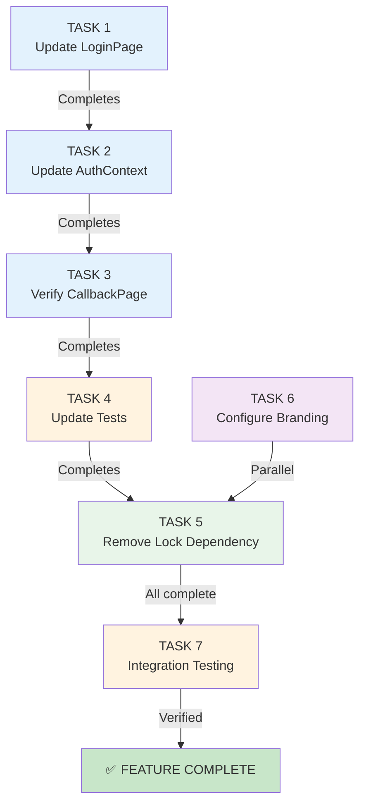

# Implementation Tasks: Auth0 Universal Login - Level 1

**Feature**: Migrate to Auth0 Universal Login with Dashboard Branding
**Version**: 1.0
**Methodology**: TDD (Red-Green-Refactor)
**Status**: READY FOR EXECUTION

## Task Breakdown

### TASK 1: Update LoginPage Component (Low Risk)

**Objective**: Remove Auth0 Lock widget, implement simple login button using Universal Login

**Files Changed**:
- `src/pages/LoginPage.tsx` (83 lines → ~30 lines)
- `src/pages/LoginPage.module.css` (remove Lock-specific styles)
- `src/pages/__tests__/LoginPage.test.tsx` (update tests)

**Steps**:

1. **RED Phase** - Write failing tests
   - Test: LoginPage should render a login button
   - Test: Button should call login() from AuthContext
   - Test: Button should show loading state while logging in
   - Test: LoginPage should NOT import Auth0Lock
   - Test: LoginPage should display error if login fails
   - **Expected**: All tests fail (no implementation yet)

2. **GREEN Phase** - Implement minimal code
   ```typescript
   // src/pages/LoginPage.tsx
   import { useAuth } from '../contexts/AuthContext'
   import { useThemeColors } from '../hooks/useThemeColors'
   import styles from './LoginPage.module.css'

   export const LoginPage: React.FC = () => {
     const { login, loading, error } = useAuth()
     const { primary } = useThemeColors()

     return (
       <main className={styles.container} role="main">
         <div className={styles.card}>
           <h1>Log In</h1>
           {error && <div className={styles.error}>{error}</div>}
           <button
             onClick={login}
             disabled={loading}
             style={{ backgroundColor: primary.main }}
             className={styles.button}
           >
             {loading ? 'Logging in...' : 'Log In with Auth0'}
           </button>
         </div>
       </main>
     )
   }
   ```
   - Remove: `import Auth0Lock from 'auth0-lock'`
   - Remove: Lock useRef, useEffect, requestAnimationFrame
   - Add: Simple button that calls login()
   - **Expected**: All tests pass

3. **REFACTOR Phase** - Clean up code
   - Verify CSS module has appropriate styles
   - Ensure accessibility (button has proper role, focus state)
   - Update JSDoc comments
   - Verify TypeScript types correct

**Acceptance Criteria**:
- [ ] LoginPage renders single login button
- [ ] Button calls `login()` from AuthContext
- [ ] Loading state shown during redirect
- [ ] Error displayed if auth fails
- [ ] No Auth0Lock import
- [ ] No Lock-specific DOM elements
- [ ] All tests pass
- [ ] ESLint and Stylelint pass
- [ ] TypeScript strict mode passes

**Risk Level**: Low
**Effort**: 1-2 hours
**Dependencies**: None

---

### TASK 2: Update AuthContext Configuration (Low Risk)

**Objective**: Clarify AuthContext uses Universal Login (already implemented)

**Files Changed**:
- `src/contexts/AuthContext.tsx` (comments and documentation)
- `src/config/authConfig.ts` (verify unchanged)

**Steps**:

1. **Review Phase** - Analyze current implementation
   - AuthContext already calls `client.loginWithRedirect()`
   - AuthContext already calls `client.handleRedirectCallback()`
   - Configuration already in place
   - **Task**: Clarify comments, remove Lock references

2. **Update Phase** - Improve documentation
   ```typescript
   // Line 163-172: Update login() function comment
   /**
    * Initiates Universal Login redirect
    * User redirected to Auth0's hosted login page
    * After authentication, redirected back to /callback
    *
    * Note: Uses Universal Login (auth0-spa-js), not embedded Lock widget
    */
   const login = useCallback(async () => {
     if (!auth0Client) return
     try {
       // loginWithRedirect() redirects to Universal Login page (official Auth0 pattern)
       await auth0Client.loginWithRedirect()
     } catch (err) {
       // error handling
     }
   }, [auth0Client])
   ```

3. **Verification Phase** - Confirm no changes needed
   - Verify `authorizationParams` includes scope, audience, redirect_uri
   - Verify `handleRedirectCallback()` called in initialization
   - Verify token exchange works
   - **Expected**: No logic changes needed

**Acceptance Criteria**:
- [ ] Comments clarified (mention Universal Login, not Lock)
- [ ] No functional changes to AuthContext
- [ ] Configuration remains the same
- [ ] All existing tests pass
- [ ] ESLint and Stylelint pass

**Risk Level**: Low
**Effort**: 30 minutes
**Dependencies**: TASK 1

---

### TASK 3: Verify CallbackPage Works (Low Risk)

**Objective**: Ensure CallbackPage handles Universal Login callback correctly

**Files Changed**:
- `src/pages/CallbackPage.tsx` (optional comment updates)
- `src/pages/__tests__/CallbackPage.test.tsx` (update mocks)

**Steps**:

1. **Review Phase** - Analyze current implementation
   - CallbackPage already checks for code/state
   - CallbackPage already calls handleRedirectCallback() indirectly (via AuthContext)
   - CallbackPage already waits for isAuthenticated
   - CallbackPage already redirects on success
   - **Assessment**: Mostly working, needs minor verification

2. **Test Phase** - Verify with updated tests
   ```typescript
   // src/pages/__tests__/CallbackPage.test.tsx
   describe('CallbackPage - Universal Login', () => {
     it('should extract authorization code from URL', () => {
       // Mock: /callback?code=xyz&state=abc
       // Verify: code and state extracted
     })

     it('should wait for AuthContext auth completion', () => {
       // Mock: isAuthenticated state changes after 500ms
       // Verify: redirect happens after auth complete
     })

     it('should redirect to home on success', () => {
       // Mock: successful auth completion
       // Verify: navigate() called with '/'
     })

     it('should display error from Auth0', () => {
       // Mock: /callback?error=access_denied&error_description=User+cancelled
       // Verify: error displayed, no redirect
     })

     it('should timeout after 8 seconds', () => {
       // Mock: auth never completes
       // Verify: error displayed after 8 second timeout
     })
   })
   ```

3. **Verify Phase** - Test with real Auth0 (manual)
   - Start dev server: `npm run start`
   - Navigate to /login
   - Click login button
   - Complete login at Auth0
   - Verify redirected to /callback
   - Verify redirected to home page
   - Verify user is authenticated

**Acceptance Criteria**:
- [ ] CallbackPage handles redirect correctly
- [ ] Code and state extracted from URL
- [ ] Waits for AuthContext auth completion
- [ ] Redirects to home on success
- [ ] Displays error on failure
- [ ] Timeout error after 8 seconds
- [ ] All tests pass
- [ ] Manual testing successful

**Risk Level**: Low
**Effort**: 1-2 hours
**Dependencies**: TASK 1, TASK 2

---

### TASK 4: Update Test Suite (Low Risk)

**Objective**: Update all Auth tests to reflect Universal Login pattern

**Files Changed**:
- `src/contexts/__tests__/AuthContext.test.ts` (update mocks)
- `src/pages/__tests__/LoginPage.test.tsx` (new tests for button)
- `src/pages/__tests__/CallbackPage.test.tsx` (update redirect mocks)

**Steps**:

1. **RED Phase** - Write tests for new behavior
   - LoginPage button test (not Lock widget)
   - AuthContext loginWithRedirect() test
   - CallbackPage universal login flow test

2. **GREEN Phase** - Update mocks and assertions
   ```typescript
   // Example: AuthContext test update
   it('should call loginWithRedirect when login called', async () => {
     const mockLoginWithRedirect = jest.fn()
     const mockClient = {
       loginWithRedirect: mockLoginWithRedirect,
       // ... other mocks
     }

     const { login } = renderWithAuth({ client: mockClient })
     await login()

     expect(mockLoginWithRedirect).toHaveBeenCalledWith(
       expect.objectContaining({
         authorizationParams: expect.objectContaining({
           redirect_uri: expect.any(String),
           scope: 'openid profile email',
           audience: expect.any(String),
         }),
       })
     )
   })
   ```

3. **REFACTOR Phase** - Clean up test structure
   - Remove Lock-specific test utilities
   - Use consistent mock patterns
   - Add clear test descriptions

**Acceptance Criteria**:
- [ ] No references to Auth0Lock in tests
- [ ] Tests verify loginWithRedirect() called
- [ ] Tests verify handleRedirectCallback() called
- [ ] Mocks reflect Universal Login flow
- [ ] All tests passing (npm run test)
- [ ] Code coverage above 80%
- [ ] No Skip() tests

**Risk Level**: Low
**Effort**: 2-3 hours
**Dependencies**: TASK 1, TASK 2, TASK 3

---

### TASK 5: Remove Auth0 Lock Dependency (Low Risk)

**Objective**: Remove Lock package, clean up unused code

**Files Changed**:
- `package.json` (remove auth0-lock)
- `package-lock.json` (regenerated)

**Steps**:

1. **Remove Package**:
   ```bash
   npm uninstall auth0-lock
   npm install
   ```

2. **Verify Cleanup**:
   - Check no imports of auth0-lock exist
   - Run npm run lint (should pass)
   - Run tests: `npm run test` (should pass)
   - Build: `npm run build` (should succeed)

3. **Commit Changes**:
   ```bash
   git add package.json package-lock.json
   git commit -m "Remove auth0-lock dependency"
   ```

**Acceptance Criteria**:
- [ ] auth0-lock removed from package.json
- [ ] npm install succeeds
- [ ] No import statements reference auth0-lock
- [ ] npm run lint passes
- [ ] npm run test passes
- [ ] npm run build succeeds
- [ ] No console errors/warnings

**Risk Level**: Low
**Effort**: 30 minutes
**Dependencies**: TASK 1

---

### TASK 6: Configure Auth0 Dashboard Branding (Manual - Low Risk)

**Objective**: Set up branded colors and logo on Universal Login page

**Files Changed**: None (manual Auth0 Dashboard configuration)

**Steps**:

1. **Access Auth0 Dashboard**:
   - Go to https://manage.auth0.com
   - Select your tenant
   - Navigate to **Branding** > **Universal Login**

2. **Configure Colors**:
   - Click **Customization Options**
   - Set **Primary Color**: `#667eea` (design system primary)
   - Set **Page Background**: `#f9fafb` (design system background)
   - Save changes

3. **Upload Logo**:
   - Click **Logo** section
   - Upload logo image (min 2000px wide, JPEG format)
   - Ensure URL is publicly accessible
   - Set height/positioning as desired
   - Save changes

4. **Verify Branding**:
   - Click **Test Connection** (if available)
   - Or navigate to /login and test manually
   - Verify colors appear on Auth0 login page
   - Verify logo is visible

**Acceptance Criteria**:
- [ ] Primary color set to #667eea
- [ ] Background color set to #f9fafb
- [ ] Logo uploaded and visible
- [ ] Logo URL is public
- [ ] Settings saved in Auth0 Dashboard
- [ ] Branding appears on login page
- [ ] Branding visible on signup page
- [ ] Branding visible on MFA page

**Risk Level**: Very Low
**Effort**: 15 minutes
**Dependencies**: None (manual task)

---

### TASK 7: Integration Testing & Verification (Medium Risk)

**Objective**: Test complete flow end-to-end with real Auth0 tenant

**Steps**:

1. **Setup Test Environment**:
   ```bash
   # Install dependencies
   npm install

   # Start dev server
   npm run start
   # Navigate to http://localhost:3000
   ```

2. **Test Login Flow**:
   - Click "Log In" button on /login
   - Verify redirected to Auth0 login page
   - Verify branding visible (colors, logo)
   - Enter valid test credentials
   - Verify redirected to /callback
   - Verify "Processing authentication..." loading state
   - Verify redirected to home page after ~2-3 seconds
   - Verify user is authenticated

3. **Test Error Scenarios**:
   - Try login with invalid credentials
   - Verify "Login failed" message displayed
   - Verify link to retry
   - Try clicking back button during Auth0 login
   - Verify app doesn't crash
   - Try logout and verify tokens cleared

4. **Test Recovery**:
   - Simulate slow network (Dev Tools)
   - Click login
   - Verify still redirected (not hanging)
   - Complete auth with slow connection
   - Verify eventually completes

5. **Test Session Persistence**:
   - Login successfully
   - Refresh page
   - Verify user still authenticated
   - Verify user data loaded
   - Verify access token available

**Acceptance Criteria**:
- [ ] Full login flow completes successfully
- [ ] Branding visible on Auth0 page
- [ ] Redirect to home page on success
- [ ] Error handling works
- [ ] Recovery from slow network works
- [ ] Session persists across page refresh
- [ ] No console errors
- [ ] No auth state inconsistencies

**Risk Level**: Medium
**Effort**: 2-3 hours
**Dependencies**: TASK 1-6

---

## Task Execution Order



## Risk Assessment

| Task | Risk | Mitigation |
|------|------|-----------|
| TASK 1 | Low | Existing auth context, simple button component |
| TASK 2 | Low | AuthContext already uses Universal Login |
| TASK 3 | Low | CallbackPage already handles redirect flow |
| TASK 4 | Low | Update existing test suite, no new patterns |
| TASK 5 | Low | Just removing package, no logic changes |
| TASK 6 | Very Low | Dashboard configuration only |
| TASK 7 | Medium | Real Auth0 testing required, slow network handling |

## Success Metrics

- ✅ All 7 tasks completed
- ✅ All tests passing (npm run test)
- ✅ Linting passes (npm run lint)
- ✅ Build succeeds (npm run build)
- ✅ Manual integration testing successful
- ✅ No console errors
- ✅ Auth0 login page displays branded colors and logo
- ✅ Full login-logout-login cycle works
- ✅ Session persistence works
- ✅ Error handling works

## Effort Summary

| Task | Duration | Risk |
|------|----------|------|
| TASK 1 | 1-2 hours | Low |
| TASK 2 | 30 min | Low |
| TASK 3 | 1-2 hours | Low |
| TASK 4 | 2-3 hours | Low |
| TASK 5 | 30 min | Low |
| TASK 6 | 15 min | Very Low |
| TASK 7 | 2-3 hours | Medium |
| **TOTAL** | **8-12 hours** | **Low-Medium** |

---

**Status**: READY FOR IMPLEMENTATION

**Next Step**: Begin TASK 1 - Update LoginPage Component
