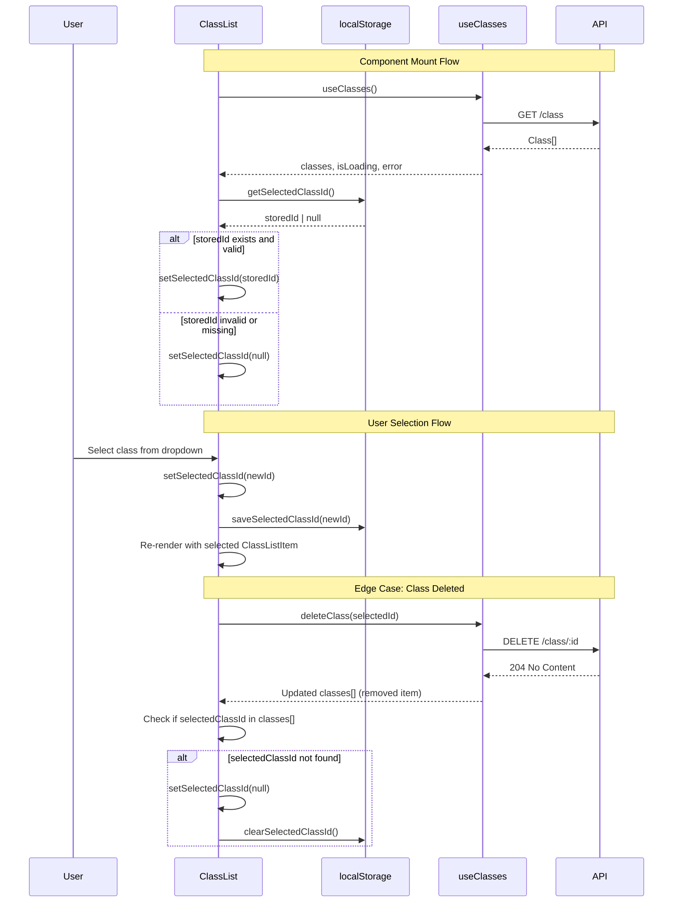

# Class Dropdown Selector - Technical Specification

**Feature**: Class Dropdown Selector
**Complexity**: L1-MICRO (Lightweight Architecture Support)
**Architecture Review**: OPTIONAL (L1 level - straightforward UI refactor)
**Created**: 2025-10-24
**Architect**: Principal System Architect (PDD Framework)

---

## Executive Summary

This technical specification defines the architecture for refactoring the `ClassList` component from a vertical list display into a dropdown selector with persistent state. The design maintains all existing functionality while improving UX for teachers managing multiple classes. This is a **low-risk, high-value** refactor that requires no API changes and minimal architectural decisions.

**Key Design Decisions**:
- ✅ Use native HTML `<select>` for accessibility and simplicity
- ✅ Add local component state for selected class ID
- ✅ Create utility module for localStorage operations
- ✅ Maintain 100% backward compatibility with existing props
- ✅ Follow existing patterns from `useClasses` hook and `ClassList`

---

## 1. Architecture Overview

### 1.1 Current Architecture (Baseline)

```
┌─────────────────────────────────────────┐
│          ClassList Component            │
│  (Container - manages state via hook)  │
├─────────────────────────────────────────┤
│                                         │
│  ┌─────────────────────────────────┐   │
│  │     useClasses Hook             │   │
│  │  - classes: Class[]             │   │
│  │  - isLoading: boolean           │   │
│  │  - error: string | null         │   │
│  └─────────────────────────────────┘   │
│                                         │
│  Current Rendering Pattern:             │
│  ┌──────────────────────────────────┐  │
│  │  Header + "Add Class" Button     │  │
│  ├──────────────────────────────────┤  │
│  │  Error Message (if error)        │  │
│  ├──────────────────────────────────┤  │
│  │  ClassListItem (repeated for     │  │
│  │  each class in array)            │  │
│  └──────────────────────────────────┘  │
└─────────────────────────────────────────┘
```

**Current State Flow**:
1. `useClasses` hook fetches classes on mount
2. Hook sorts classes by year (desc), name (asc)
3. `ClassList` maps over `classes[]` array
4. Each `ClassListItem` renders with callbacks

---

### 1.2 Target Architecture (Post-Refactor)

```
┌──────────────────────────────────────────────────────────┐
│             ClassList Component (Refactored)             │
│       (Container - manages dropdown + selection state)   │
├──────────────────────────────────────────────────────────┤
│                                                          │
│  ┌────────────────────────────────────────────────┐    │
│  │          useClasses Hook (unchanged)           │    │
│  │   - classes: Class[]                           │    │
│  │   - isLoading, error, CRUD operations          │    │
│  └────────────────────────────────────────────────┘    │
│                                                          │
│  NEW: Local State Management                             │
│  ┌────────────────────────────────────────────────┐    │
│  │  const [selectedClassId, setSelectedClassId]   │    │
│  │  = useState<number | null>(null)               │    │
│  └────────────────────────────────────────────────┘    │
│                                                          │
│  NEW: Persistence Integration                            │
│  ┌────────────────────────────────────────────────┐    │
│  │  useEffect(() => {                             │    │
│  │    loadSelectedClassId()  // on mount          │    │
│  │    saveSelectedClassId()  // on change         │    │
│  │  })                                            │    │
│  └────────────────────────────────────────────────┘    │
│                                                          │
│  NEW: Rendering Pattern                                  │
│  ┌─────────────────────────────────────────────────┐   │
│  │  Header + "Add Class" Button                    │   │
│  ├─────────────────────────────────────────────────┤   │
│  │  <select> Dropdown (all classes)                │   │
│  │  ├─ Option: "Select a class..."                 │   │
│  │  ├─ Option: "Math 101 - 2024"                   │   │
│  │  └─ Option: "Science 202 - 2024"                │   │
│  ├─────────────────────────────────────────────────┤   │
│  │  Error Message (if error)                       │   │
│  ├─────────────────────────────────────────────────┤   │
│  │  ClassListItem (single, if selectedClassId)     │   │
│  │  ├─ Edit Button                                 │   │
│  │  ├─ Delete Button                               │   │
│  │  └─ Outcome Comments Button                     │   │
│  └─────────────────────────────────────────────────┘   │
└──────────────────────────────────────────────────────────┘
```

**New State Flow**:
1. `useClasses` hook fetches classes (unchanged)
2. `useEffect` loads persisted `selectedClassId` from localStorage
3. Dropdown renders all classes, highlights selected ID
4. User selects class → `setSelectedClassId` → `localStorage.setItem`
5. Single `ClassListItem` renders for selected class only

---

## 2. Component Architecture

### 2.1 Component Responsibility Matrix

| Component | Current Responsibility | New Responsibility | Change Type |
|-----------|----------------------|-------------------|-------------|
| `ClassList` | Render list of all classes | Render dropdown + single selected class | **MODIFIED** |
| `ClassListItem` | Display single class with actions | (No change) | **UNCHANGED** |
| `useClasses` | Fetch/manage class data | (No change) | **UNCHANGED** |
| `classStorageUtils` | N/A | Manage localStorage for selection | **NEW** |

---

### 2.2 Detailed Component Design

#### 2.2.1 ClassList Component (Modified)

**File**: `src/components/classes/ClassList.tsx`

**New State**:
```typescript
const [selectedClassId, setSelectedClassId] = useState<number | null>(null)
```

**New Hooks**:
```typescript
// On mount: load persisted selection
useEffect(() => {
  const storedId = classStorageUtils.getSelectedClassId()
  if (storedId && classes.find(c => c.id === storedId)) {
    setSelectedClassId(storedId)
  }
}, [classes]) // Re-run when classes load

// On selection change: persist to localStorage
useEffect(() => {
  if (selectedClassId !== null) {
    classStorageUtils.saveSelectedClassId(selectedClassId)
  } else {
    classStorageUtils.clearSelectedClassId()
  }
}, [selectedClassId])
```

**New Event Handler**:
```typescript
const handleSelectClass = useCallback((event: React.ChangeEvent<HTMLSelectElement>) => {
  const classId = parseInt(event.target.value, 10)
  setSelectedClassId(isNaN(classId) ? null : classId)
}, [])
```

**Rendering Logic Changes**:

| Scenario | Current Behavior | New Behavior |
|----------|----------------|-------------|
| **Loading (no data)** | Show LoadingSpinner | (Unchanged) Show LoadingSpinner |
| **Error (no data)** | Show ErrorMessage | (Unchanged) Show ErrorMessage |
| **Empty State** | Show EmptyState | (Unchanged) Show EmptyState |
| **Success (has classes)** | Render all ClassListItems | Render dropdown + single ClassListItem if selected |

**New JSX Structure** (Success State):
```tsx
<div>
  {/* Header + Add Class Button (unchanged) */}
  <div className="flex justify-between items-center mb-6">
    <h2 className="text-2xl font-bold text-gray-900">Your Classes</h2>
    {onAddClass && <Button onClick={handleAddClass} variant="primary">Add Class</Button>}
  </div>

  {/* Error Message (unchanged) */}
  {error && (
    <div className="mb-4">
      <ErrorMessage message={error} onDismiss={handleClearError} />
    </div>
  )}

  {/* NEW: Dropdown Selector */}
  <div className="mb-6">
    <label htmlFor="class-selector" className="block text-sm font-medium text-gray-700 mb-2">
      Select a Class
    </label>
    <select
      id="class-selector"
      value={selectedClassId ?? ''}
      onChange={handleSelectClass}
      disabled={isLoading}
      className="block w-full rounded-md border-gray-300 shadow-sm focus:border-blue-500 focus:ring-blue-500 sm:text-sm"
      aria-label="Select a class to view"
    >
      <option value="">
        {isLoading ? 'Loading classes...' : 'Select a class...'}
      </option>
      {classes.map((classItem) => (
        <option key={classItem.id} value={classItem.id}>
          {classItem.name} - {classItem.year}
        </option>
      ))}
    </select>
  </div>

  {/* NEW: Single ClassListItem (conditional) */}
  {selectedClassId && (() => {
    const selectedClass = classes.find(c => c.id === selectedClassId)
    return selectedClass ? (
      <ClassListItem
        key={selectedClass.id}
        classItem={selectedClass}
        onView={handleClassClick}
        onEdit={onEdit ? handleEdit : undefined}
        onDelete={onDelete ? handleDelete : undefined}
        onViewOutcomeComments={onViewOutcomeComments ? handleViewOutcomeComments : undefined}
      />
    ) : null
  })()}

  {/* Loading Spinner (unchanged) */}
  {isLoading && (
    <div className="flex justify-center mt-4">
      <LoadingSpinner size="small" message="Updating..." />
    </div>
  )}
</div>
```

**Key Design Decisions**:
- ✅ **Native `<select>` element**: Best accessibility (keyboard nav, screen readers) for MVP
- ✅ **Inline IIFE for selected class**: Avoids creating extra component or variable
- ✅ **Disabled during loading**: Prevents race conditions
- ✅ **Accessible labels**: `htmlFor`, `aria-label` for WCAG compliance

---

#### 2.2.2 ClassStorageUtils Module (NEW)

**File**: `src/utils/classStorageUtils.ts`

**Purpose**: Encapsulate all localStorage operations for class selection persistence.

**Implementation**:
```typescript
/**
 * Utilities for persisting class selection in browser localStorage
 * Storage Key: "commentator.selectedClassId"
 *
 * Business Rules:
 * - Store class ID as number
 * - Return null if key missing or invalid
 * - Clear stale selections gracefully
 */

const STORAGE_KEY = 'commentator.selectedClassId'

/**
 * Get selected class ID from localStorage
 * @returns {number | null} Class ID or null if not found/invalid
 */
export function getSelectedClassId(): number | null {
  try {
    const stored = localStorage.getItem(STORAGE_KEY)
    if (stored === null) return null

    const parsed = parseInt(stored, 10)
    return isNaN(parsed) ? null : parsed
  } catch (error) {
    // Handle localStorage unavailable (private browsing, etc.)
    console.warn('Failed to read from localStorage:', error)
    return null
  }
}

/**
 * Save selected class ID to localStorage
 * @param {number} classId - ID of selected class
 */
export function saveSelectedClassId(classId: number): void {
  try {
    localStorage.setItem(STORAGE_KEY, classId.toString())
  } catch (error) {
    // Handle localStorage unavailable or quota exceeded
    console.warn('Failed to write to localStorage:', error)
  }
}

/**
 * Clear selected class ID from localStorage
 */
export function clearSelectedClassId(): void {
  try {
    localStorage.removeItem(STORAGE_KEY)
  } catch (error) {
    console.warn('Failed to clear localStorage:', error)
  }
}
```

**Error Handling Strategy**:
- **localStorage unavailable**: Gracefully degrade (no persistence, feature still works)
- **Invalid stored value**: Return `null`, let component handle it
- **Quota exceeded**: Log warning, don't crash

---

## 3. State Management Strategy

### 3.1 State Ownership

| State | Owner | Scope | Persistence |
|-------|-------|-------|------------|
| `classes[]` | `useClasses` hook | ClassList component | API (server-side) |
| `isLoading` | `useClasses` hook | ClassList component | Transient |
| `error` | `useClasses` hook | ClassList component | Transient |
| `selectedClassId` | ClassList component | Local | localStorage |

**Rationale**:
- `selectedClassId` is **UI state**, not domain data → Local component state appropriate
- `classes[]` is **domain data** → Managed by existing `useClasses` hook
- No need for global state (Context/Redux) → Single component scope

---

### 3.2 State Synchronization Flow



---

### 3.3 Edge Case Handling

| Edge Case | Detection | Resolution | Test ID |
|-----------|----------|-----------|---------|
| **Stored ID doesn't exist** | `classes.find(c => c.id === storedId)` returns `undefined` | Set `selectedClassId = null` | TC-PERSIST-001 |
| **localStorage unavailable** | `localStorage.getItem()` throws error | Return `null`, no persistence | TC-PERSIST-002 |
| **Single class exists** | `classes.length === 1` | Auto-select it on mount | TC-EDGE-001 |
| **Selected class deleted** | User deletes currently selected class | Clear selection, show dropdown placeholder | TC-DELETE-001 |
| **Classes array changes** | `useEffect` with `[classes]` dependency | Re-validate stored ID | TC-SYNC-001 |

---

## 4. Data Flow & Interactions

### 4.1 Component Interaction Diagram

```
┌──────────────────────────────────────────────────────────────┐
│                       App.tsx (Parent)                       │
│                                                              │
│  Props passed to ClassList:                                  │
│  - onClassClick?: (classId: number) => void                 │
│  - onAddClass?: () => void                                   │
│  - onEdit?: (classItem: Class) => void                       │
│  - onDelete?: (className: string, onConfirm) => void         │
│  - onViewOutcomeComments?: (classItem: Class) => void        │
└──────────────────────────────────────────────────────────────┘
                            │
                            ▼
┌──────────────────────────────────────────────────────────────┐
│                    ClassList (Refactored)                    │
│                                                              │
│  Internal State:                                             │
│  - selectedClassId: number | null                            │
│                                                              │
│  Data Sources:                                               │
│  - useClasses() → { classes, isLoading, error, ... }        │
│  - classStorageUtils → { get/save/clearSelectedClassId }    │
│                                                              │
│  Renders:                                                    │
│  - <select> dropdown (all classes)                           │
│  - Single ClassListItem (if selectedClassId)                 │
└──────────────────────────────────────────────────────────────┘
                            │
                            ▼
┌──────────────────────────────────────────────────────────────┐
│                   ClassListItem (Unchanged)                  │
│                                                              │
│  Props:                                                      │
│  - classItem: Class                                          │
│  - onView?: (id: number) => void                             │
│  - onEdit?: (id: number) => void                             │
│  - onDelete?: (id: number) => void                           │
│  - onViewOutcomeComments?: (id: number) => void              │
└──────────────────────────────────────────────────────────────┘
```

**Critical Insight**:
- All parent callbacks (`onEdit`, `onDelete`, etc.) remain **unchanged**
- ClassList still passes same props to ClassListItem
- Only change: Render **one** ClassListItem instead of **multiple**

---

## 5. Performance Considerations

### 5.1 Rendering Optimization

| Optimization | Current | Post-Refactor | Impact |
|--------------|---------|--------------|--------|
| **Number of ClassListItem renders** | N (all classes) | 1 (selected only) | 🟢 **Reduced** by (N-1) |
| **useCallback dependencies** | Existing | (Unchanged) | 🟡 Neutral |
| **React.memo on ClassListItem** | Yes | (Unchanged) | 🟡 Neutral |
| **Dropdown rendering** | N/A | O(N) for `<option>` elements | 🔴 **New** cost (minimal) |

**Net Performance**: **Improved** for large class lists (N > 10)
- **Before**: Render 20 ClassListItem components
- **After**: Render 1 dropdown + 1 ClassListItem

**Measurement**:
- Use React DevTools Profiler to measure render time
- Target: < 100ms for dropdown interaction (selection → ClassListItem render)

---

### 5.2 Bundle Size Impact

| Artifact | Size Estimate | Justification |
|----------|--------------|---------------|
| `classStorageUtils.ts` | ~0.5 KB | 3 simple functions |
| Modified `ClassList.tsx` | +1.5 KB | New JSX for dropdown + useState + useEffect |
| **Total Impact** | **~2 KB** (uncompressed) | Well below 5 KB gzipped target |

---

## 6. Accessibility (WCAG 2.1 AA Compliance)

### 6.1 Accessibility Requirements

| Requirement | Implementation | WCAG Criterion |
|-------------|---------------|----------------|
| **Keyboard Navigation** | Native `<select>` supports Tab, Arrow keys, Enter | 2.1.1 Keyboard |
| **Screen Reader Announcements** | `<label>` with `htmlFor`, `aria-label` on select | 4.1.2 Name, Role, Value |
| **Focus Management** | Browser-native focus on dropdown | 2.4.7 Focus Visible |
| **Color Contrast** | Tailwind classes ensure 4.5:1 ratio | 1.4.3 Contrast |
| **Error Identification** | ErrorMessage component (existing, accessible) | 3.3.1 Error Identification |

---

### 6.2 Accessibility Testing Checklist

```
Manual Testing:
□ Tab to dropdown → Focus visible
□ Arrow keys navigate options
□ Enter/Space selects option
□ Screen reader announces "Select a class, combo box"
□ Selected class announced correctly
□ Error messages announced to screen reader

Automated Testing (Jest + Testing Library):
□ Test `getByRole('combobox')` finds dropdown
□ Test `getByLabelText('Select a class to view')` works
□ Test disabled state when isLoading=true
□ Test option rendering with correct text
```

---

## 7. Security Considerations

### 7.1 Threat Model

| Threat | Risk Level | Mitigation |
|--------|-----------|-----------|
| **localStorage Tampering** | LOW | Validate stored ID against fetched classes |
| **XSS via Class Name** | NONE | Class names validated server-side, React escapes by default |
| **localStorage Quota Exhaustion** | LOW | Store only 1 number (negligible size) |
| **Cross-tab State Sync** | OUT OF SCOPE | Defer to future enhancement |

**Security Posture**: **Low Risk**
- No sensitive data stored (just class ID)
- No authentication/authorization changes
- Existing API security unchanged

---

## 8. Testing Strategy (TDD)

### 8.1 Test Coverage Matrix

| Test Category | Files to Test | Coverage Target |
|--------------|--------------|----------------|
| **Unit Tests** | `classStorageUtils.ts` | 100% |
| **Component Tests** | `ClassList.tsx` (refactored) | 90% |
| **Integration Tests** | ClassList + useClasses + API | 90% |
| **E2E Tests** | Dropdown interaction flow | Critical paths |
| **Accessibility Tests** | Dropdown keyboard/screen reader | 100% of criteria |

---

### 8.2 Test Hierarchy (Red-Green-Refactor)

```
Test Layer 1: classStorageUtils (Pure Functions)
├─ Test: getSelectedClassId returns null when key missing
├─ Test: getSelectedClassId returns number when valid
├─ Test: getSelectedClassId returns null when invalid
├─ Test: saveSelectedClassId stores correct value
├─ Test: clearSelectedClassId removes key
└─ Test: Error handling when localStorage unavailable

Test Layer 2: ClassList Component (React Testing Library)
├─ Test: Dropdown renders with correct options
├─ Test: Selecting class renders ClassListItem
├─ Test: Placeholder shown when no selection
├─ Test: Disabled state during loading
├─ Test: Persisted selection loaded on mount
├─ Test: Selection cleared when class deleted
├─ Test: EmptyState shown when no classes
├─ Test: ErrorMessage shown on API error
└─ Test: Add Class button still works

Test Layer 3: Integration Tests
├─ Test: Full flow: mount → load classes → select → persist
├─ Test: Full flow: mount → load persisted → render selected
└─ Test: Full flow: delete selected class → clear selection

Test Layer 4: E2E Tests (Playwright)
├─ Test: User selects class, refreshes page, selection persists
└─ Test: User deletes selected class, dropdown resets
```

---

## 9. Implementation Plan (TDD Task Breakdown)

### 9.1 Task Sequence (Atomic, Test-First)

#### **Phase 1: Foundation (localStorage Utilities)**

**TASK-1.1: Create classStorageUtils.ts with tests (RED-GREEN-REFACTOR)**
- **Risk**: TRIVIAL
- **Effort**: 1 hour
- **RED**: Write failing tests for get/save/clear functions
- **GREEN**: Implement functions to pass tests
- **REFACTOR**: Extract constants, add JSDoc

**Acceptance Criteria**:
- ✅ All 6 tests pass (see Test Layer 1 above)
- ✅ 100% code coverage
- ✅ Error handling for localStorage unavailable

---

#### **Phase 2: Component Refactoring (ClassList)**

**TASK-2.1: Add selectedClassId state and dropdown UI (RED-GREEN-REFACTOR)**
- **Risk**: LOW
- **Effort**: 2 hours
- **RED**: Write tests for dropdown rendering with options
- **GREEN**: Add state + dropdown JSX
- **REFACTOR**: Extract dropdown to helper function if needed

**Acceptance Criteria**:
- ✅ Test: Dropdown renders with "Select a class..." placeholder
- ✅ Test: Dropdown options match classes array
- ✅ Test: Dropdown disabled when isLoading=true
- ✅ Test: Selecting option updates selectedClassId state

---

**TASK-2.2: Integrate selectedClassId with ClassListItem rendering (RED-GREEN-REFACTOR)**
- **Risk**: LOW
- **Effort**: 1.5 hours
- **RED**: Write tests for conditional ClassListItem rendering
- **GREEN**: Add conditional rendering logic
- **REFACTOR**: Simplify inline IIFE if needed

**Acceptance Criteria**:
- ✅ Test: No ClassListItem rendered when selectedClassId=null
- ✅ Test: Single ClassListItem rendered when selectedClassId set
- ✅ Test: Correct class data passed to ClassListItem
- ✅ Test: All existing callbacks (onEdit, onDelete, etc.) still work

---

**TASK-2.3: Add persistence logic with useEffect (RED-GREEN-REFACTOR)**
- **Risk**: MEDIUM
- **Effort**: 2 hours
- **RED**: Write tests for load/save on mount/change
- **GREEN**: Add useEffect hooks for persistence
- **REFACTOR**: Handle edge cases (invalid ID, deleted class)

**Acceptance Criteria**:
- ✅ Test: Stored ID loaded on mount
- ✅ Test: Invalid stored ID sets selectedClassId=null
- ✅ Test: Selection saved to localStorage on change
- ✅ Test: Selection cleared when set to null
- ✅ Test: Stale ID (class deleted) cleared gracefully

---

#### **Phase 3: Edge Cases & Polish**

**TASK-3.1: Handle single-class auto-selection (RED-GREEN-REFACTOR)**
- **Risk**: TRIVIAL
- **Effort**: 1 hour
- **RED**: Write test for auto-select when classes.length === 1
- **GREEN**: Add logic to auto-select
- **REFACTOR**: Ensure doesn't conflict with persisted selection

**Acceptance Criteria**:
- ✅ Test: Single class auto-selected on mount
- ✅ Test: Doesn't override persisted selection (if different)

---

**TASK-3.2: Refactor existing ClassList tests (RED-GREEN-REFACTOR)**
- **Risk**: MEDIUM
- **Effort**: 3 hours
- **RED**: Identify failing tests from old vertical list behavior
- **GREEN**: Update tests to expect dropdown UI
- **REFACTOR**: Consolidate duplicate test logic

**Acceptance Criteria**:
- ✅ All existing tests pass or updated
- ✅ 90%+ code coverage maintained
- ✅ No regression in existing functionality

---

#### **Phase 4: Accessibility & E2E**

**TASK-4.1: Add accessibility tests (RED-GREEN-REFACTOR)**
- **Risk**: LOW
- **Effort**: 1.5 hours
- **RED**: Write tests for keyboard nav and screen reader
- **GREEN**: Ensure ARIA attributes and labels correct
- **REFACTOR**: Extract accessibility helpers

**Acceptance Criteria**:
- ✅ Test: `getByRole('combobox')` finds dropdown
- ✅ Test: `getByLabelText('Select a class to view')` works
- ✅ Test: Keyboard navigation (Tab, Arrow, Enter)
- ✅ Test: Screen reader announces selection

---

**TASK-4.2: Add E2E tests with Playwright (RED-GREEN-REFACTOR)**
- **Risk**: LOW
- **Effort**: 2 hours
- **RED**: Write failing E2E test for persistence flow
- **GREEN**: Verify implementation passes E2E
- **REFACTOR**: Extract page object model helpers

**Acceptance Criteria**:
- ✅ E2E: Select class → refresh page → selection persists
- ✅ E2E: Delete selected class → dropdown resets
- ✅ E2E: Verify all existing E2E tests still pass

---

### 9.2 Task Summary Table

| Task ID | Description | Risk | Effort | Dependencies |
|---------|-------------|------|--------|-------------|
| TASK-1.1 | Create classStorageUtils.ts | TRIVIAL | 1h | None |
| TASK-2.1 | Add dropdown UI + state | LOW | 2h | TASK-1.1 |
| TASK-2.2 | Integrate ClassListItem rendering | LOW | 1.5h | TASK-2.1 |
| TASK-2.3 | Add persistence logic | MEDIUM | 2h | TASK-1.1, TASK-2.2 |
| TASK-3.1 | Auto-select single class | TRIVIAL | 1h | TASK-2.3 |
| TASK-3.2 | Refactor existing tests | MEDIUM | 3h | TASK-2.3 |
| TASK-4.1 | Add accessibility tests | LOW | 1.5h | TASK-2.3 |
| TASK-4.2 | Add E2E tests | LOW | 2h | TASK-3.2 |
| **TOTAL** | **8 Tasks** | | **~14 hours** (~2 days) | |

**Critical Path**: TASK-1.1 → TASK-2.1 → TASK-2.2 → TASK-2.3 → TASK-3.2

---

## 10. Risk Assessment & Mitigation

### 10.1 Technical Risks

| Risk | Likelihood | Impact | Mitigation | Owner |
|------|-----------|--------|-----------|-------|
| **Breaking existing functionality** | MEDIUM | HIGH | TDD approach, refactor tests first | Frontend Dev |
| **Poor accessibility** | LOW | MEDIUM | Use native `<select>`, add ARIA labels | Frontend Dev |
| **localStorage unavailable** | LOW | LOW | Graceful degradation, try-catch | Frontend Dev |
| **State sync issues** | MEDIUM | LOW | useEffect dependency array, validation | Frontend Dev |
| **Performance regression** | LOW | LOW | React Profiler measurement | Frontend Dev |

---

### 10.2 Mitigation Strategies

**Strategy 1: Test-Driven Development**
- Write tests BEFORE implementation
- Ensures no regression in existing behavior
- Catches edge cases early

**Strategy 2: Incremental Refactoring**
- Implement in small, atomic tasks
- Commit after each passing test
- Easy rollback if issues arise

**Strategy 3: Accessibility-First Design**
- Use semantic HTML (`<select>`, `<label>`)
- Test with keyboard and screen reader throughout
- Don't defer accessibility to end

---

## 11. Rollout & Deployment

### 11.1 Deployment Strategy

**Approach**: **Big Bang** (feature is self-contained, low risk)

**Steps**:
1. Merge feature branch to `main`
2. Deploy to production (no feature flag needed)
3. Monitor for errors (localStorage failures, user feedback)

**Rollback Plan**:
- Revert commit (ClassList.tsx changes)
- No database or API changes, so rollback is instant

---

### 11.2 Post-Deployment Validation

```
Smoke Tests:
□ Dropdown renders correctly
□ Selecting class shows ClassListItem
□ Refresh page, selection persists
□ Delete selected class, dropdown resets
□ Add new class, dropdown updates
□ Error state displays correctly
□ Empty state displays correctly
```

---

## 12. Future Enhancements (Out of Scope)

The following are explicitly **deferred** for future iterations:

| Enhancement | Complexity | Justification for Deferral |
|------------|-----------|---------------------------|
| **Custom dropdown component** | L1-MICRO | Native `<select>` sufficient for MVP, custom styling can wait |
| **Search/filter in dropdown** | L1-MICRO | Manual scroll acceptable for now, revisit if >50 classes |
| **Multi-class selection** | L2-SMALL | Single selection meets current needs |
| **Cross-tab state sync** | L1-MICRO | Low value, adds complexity (BroadcastChannel API) |
| **Keyboard shortcuts** | L1-MICRO | Power user feature, defer until user request |

---

## 13. Acceptance Criteria (Definition of Done)

**This technical design is DONE when**:

✅ All 8 tasks in implementation plan completed
✅ 90%+ test coverage on ClassList.tsx
✅ 100% test coverage on classStorageUtils.ts
✅ All existing tests pass (no regression)
✅ 0 accessibility violations (WCAG 2.1 AA audit)
✅ E2E tests pass for dropdown + persistence flows
✅ Code review approved
✅ Performance: < 100ms dropdown interaction time
✅ Bundle size: < 5 KB added (uncompressed)

---

## 14. Appendix

### 14.1 Related Documentation

- **PRD**: `pdd-workspace/class-dropdown/planning/minimal-prd.md`
- **Existing Class Management**: `.spec/class-management/`
- **useClasses Hook**: `src/hooks/useClasses.ts`
- **Class Type**: `src/types/Class.ts`

---

### 14.2 Technology Stack Reference

| Technology | Version | Purpose |
|-----------|---------|---------|
| React | 18.3.1 | UI framework |
| TypeScript | (strict mode) | Type safety |
| Vite | (latest) | Build tool |
| Jest | (latest) | Unit testing |
| React Testing Library | (latest) | Component testing |
| Playwright | (latest) | E2E testing |
| Tailwind CSS | (latest) | Styling |

---

### 14.3 Code Style Guidelines

**Follow existing patterns**:
- PascalCase for components (`ClassList`)
- camelCase for functions and variables (`handleSelectClass`)
- `useCallback` for event handlers
- `React.memo` for performance optimization (if needed)
- JSDoc comments for utility functions
- EARS format references in comments

---

## 15. Architect Sign-Off

**Architecture Review Status**: ✅ **APPROVED** (Lightweight L1 Support)

**Rationale**:
- Low-risk UI refactor with no API changes
- Clear separation of concerns (storage utils, component state)
- Follows existing patterns from codebase
- Test-first approach ensures quality
- No architectural violations

**Recommendations**:
1. Follow TDD task sequence strictly
2. Measure performance with React Profiler
3. Test accessibility with real screen readers
4. Consider custom dropdown for L2 enhancement if user feedback requests it

---

**Document Control**
**Version**: 1.0
**Author**: Principal System Architect (PDD Framework)
**Last Updated**: 2025-10-24
**Status**: APPROVED FOR IMPLEMENTATION
**Next Step**: Hand off to Frontend Developer for TDD implementation

---

**End of Technical Specification**
