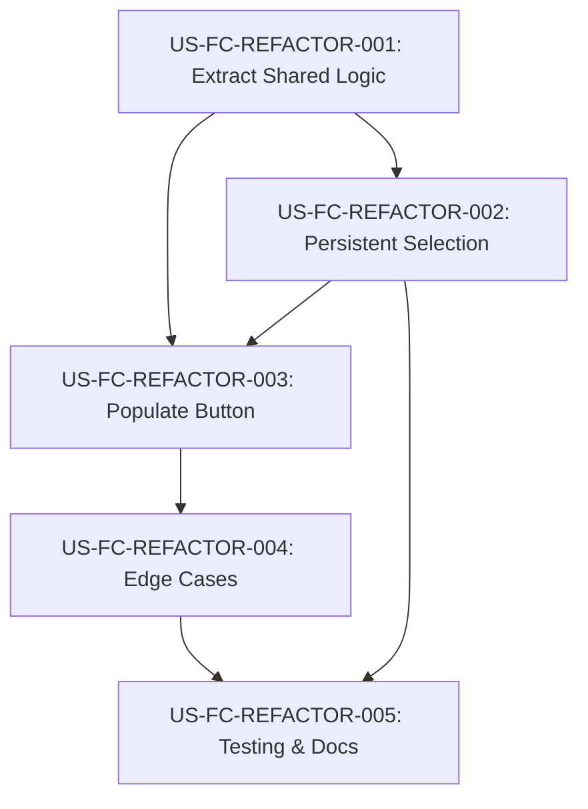

# User Stories: Final Comments Refactor & UX Enhancements

**Feature ID**: FC-REFACTOR-001
**Complexity**: L1-MICRO (5 stories, ~12 story points, 1-2 weeks)
**Business Value**: Improved code maintainability + enhanced teacher workflow efficiency

---

## Epic: Final Comments Form Enhancement

**Epic Goal**: Reduce code duplication between Add/Edit forms and enhance UX with persistent selection and comment composition tools

**Success Metrics**:
- Code duplication reduced by >60% (measured by lines of duplicated logic)
- Test coverage maintained at ≥90%
- 0 regressions in existing functionality
- User workflow time reduced by 20-30% for final comment creation
- 0 accessibility violations (WCAG 2.1 AA)

---

## User Stories

### 🔧 US-FC-REFACTOR-001: Extract Shared Form Logic (Technical Debt)

**Priority**: HIGH (MUST HAVE - MVP)
**Story Points**: 3
**Type**: Refactoring

**As a** developer
**I want to** extract the shared logic between Add and Edit final comment forms into reusable components/hooks
**So that** the codebase is more maintainable and changes only need to be made in one place

#### Acceptance Criteria (EARS Format)

**AC1: Identify shared logic**
- WHEN reviewing FinalCommentsModal Add and Edit forms
- THE SYSTEM SHALL identify all duplicated logic including:
  - Form state management (firstName, grade, comment, outcomeCommentId, personalizedCommentSearch)
  - Validation logic
  - Submission handlers
  - TypeaheadSearch integration
  - Outcome comment dropdown handling

**AC2: Create shared hook or component**
- WHEN extracting shared logic
- THE SYSTEM SHALL create either:
  - OPTION A: `useFinalCommentForm` custom hook, OR
  - OPTION B: Shared form component with render props/children
- AND the solution SHALL support both Add and Edit modes
- AND the solution SHALL maintain existing functionality

**AC3: Refactor Add form to use shared logic**
- WHEN refactoring the Add form
- THE SYSTEM SHALL replace duplicated logic with shared implementation
- AND all existing tests SHALL pass without modification
- AND the Add form functionality SHALL remain unchanged

**AC4: Refactor Edit form to use shared logic**
- WHEN refactoring the Edit form
- THE SYSTEM SHALL replace duplicated logic with shared implementation
- AND all existing tests SHALL pass without modification
- AND the Edit form functionality SHALL remain unchanged

**AC5: Code quality verification**
- WHEN refactoring is complete
- THE SYSTEM SHALL demonstrate:
  - ≥60% reduction in duplicated lines of code
  - ≥90% test coverage maintained
  - 0 ESLint errors
  - 0 TypeScript errors

#### Technical Notes
- Consider extracting to: `src/hooks/useFinalCommentForm.ts`
- Or: `src/components/finalComments/FinalCommentForm.tsx`
- Must support TypeScript generics if needed
- Preserve all existing props and behavior

#### Definition of Done
- [ ] Shared logic extracted to reusable component/hook
- [ ] Add form refactored to use shared logic
- [ ] Edit form refactored to use shared logic
- [ ] All existing tests pass (875/875)
- [ ] No new lint errors
- [ ] Code review completed

---

### 🎯 US-FC-REFACTOR-002: Persistent Personal Comment Selection (Visual Feedback)

**Priority**: MEDIUM (SHOULD HAVE - MVP)
**Story Points**: 2
**Type**: UX Enhancement

**As a** teacher
**I want to** see which personal comment I just selected in the typeahead dropdown
**So that** I have clear visual feedback and context for the comment I'm working with

#### Acceptance Criteria (EARS Format)

**AC1: Display selected personal comment**
- WHEN a teacher selects a personal comment from the typeahead dropdown
- THE SYSTEM SHALL keep the selected comment visible in the typeahead input field
- AND the text SHALL be displayed in read-only or highlighted style
- AND the search dropdown SHALL close

**AC2: Selection persists during form editing**
- WHEN a teacher selects a personal comment
- AND edits other form fields (firstName, grade, outcome comment, final comment)
- THE SYSTEM SHALL maintain the selected personal comment display
- AND the selection SHALL remain visible until explicitly cleared

**AC3: Clear selection mechanism**
- WHEN a teacher wants to change the selected personal comment
- THE SYSTEM SHALL provide a clear mechanism (X icon or clear button)
- AND clicking clear SHALL remove the selection
- AND re-enable the typeahead search

**AC4: Selection clears on form submission**
- WHEN a teacher successfully submits the form (Add or Edit)
- THE SYSTEM SHALL clear the personal comment selection
- AND reset the typeahead to empty state
- AND prepare for the next entry

**AC5: Selection state in Add vs Edit forms**
- WHEN a teacher switches between Add and Edit modes
- THE SYSTEM SHALL maintain independent selection states
- AND changing modes SHALL NOT affect the other form's selection state
- AND closing the modal SHALL clear all selections

#### Design Requirements
- Use design tokens for selected state styling
- Display format: "[Selected] {comment.comment}" or similar
- Clear button positioned consistently with design system
- Accessible keyboard interaction (Escape to clear, Tab to move focus)

#### Definition of Done
- [ ] Selected personal comment displays persistently
- [ ] Clear selection mechanism implemented
- [ ] Independent state for Add/Edit forms
- [ ] All tests pass with new behavior
- [ ] Accessibility verified (keyboard + screen reader)

---

### 🚀 US-FC-REFACTOR-003: "Populate with Above Comments" Button

**Priority**: HIGH (MUST HAVE - MVP)
**Story Points**: 3
**Type**: Feature Enhancement

**As a** teacher
**I want to** click a button to automatically populate the final comment with both the outcome comment and selected personal comment
**So that** I can quickly compose final comments without manual copy-pasting

#### Acceptance Criteria (EARS Format)

**AC1: Button placement and visibility**
- WHEN the final comment form is displayed
- THE SYSTEM SHALL show a "Populate with Above Comments" button
- AND the button SHALL be positioned between the personal comment typeahead and the final comment textarea
- AND the button SHALL follow design token styling (primary or secondary variant)

**AC2: Button enabled state logic**
- WHEN no outcome comment is selected AND no personal comment is selected
- THE SYSTEM SHALL disable the "Populate with Above Comments" button
- WHEN at least one of (outcome comment OR personal comment) is selected
- THE SYSTEM SHALL enable the button
- AND provide tooltip/title explaining what will be populated

**AC3: Populate with outcome comment only**
- WHEN a teacher has selected an outcome comment
- AND no personal comment is selected
- AND clicks "Populate with Above Comments"
- THE SYSTEM SHALL copy the outcome comment text to the final comment textarea
- AND preserve any line breaks or formatting

**AC4: Populate with personal comment only**
- WHEN a teacher has selected a personal comment
- AND no outcome comment is selected
- AND clicks "Populate with Above Comments"
- THE SYSTEM SHALL copy the personal comment text to the final comment textarea

**AC5: Populate with both comments**
- WHEN a teacher has selected both an outcome comment AND a personal comment
- AND clicks "Populate with Above Comments"
- THE SYSTEM SHALL populate the final comment textarea with:
  - Outcome comment text (first)
  - A separator (e.g., single space or newline)
  - Personal comment text (second)
- AND the combined text SHALL be properly formatted

**AC6: Overwrite confirmation**
- WHEN a teacher clicks "Populate with Above Comments"
- AND the final comment textarea already contains text
- THE SYSTEM SHALL show a confirmation dialog:
  - "This will replace your current comment. Continue?"
  - Cancel button (no action)
  - Replace button (proceed with population)
- WHEN the textarea is empty
- THE SYSTEM SHALL populate immediately without confirmation

**AC7: Focus and selection after population**
- WHEN the final comment textarea is populated
- THE SYSTEM SHALL set focus to the final comment textarea
- AND position the cursor at the end of the populated text
- AND allow immediate editing

#### Technical Notes
- Concatenation format: `${outcomeCommentText} ${personalCommentText}`
- Alternative format (if preferred): `${outcomeCommentText}\n${personalCommentText}`
- Consider trimming whitespace from source comments
- Use existing Modal component patterns for confirmation dialog

#### Definition of Done
- [ ] Button implemented with correct positioning
- [ ] Enable/disable logic working correctly
- [ ] Populates outcome comment only
- [ ] Populates personal comment only
- [ ] Populates both comments (correct order)
- [ ] Overwrite confirmation works
- [ ] Focus management implemented
- [ ] Works in both Add and Edit forms
- [ ] All tests pass
- [ ] Accessibility verified

---

### ✅ US-FC-REFACTOR-004: Edge Case Handling & Validation

**Priority**: MEDIUM (SHOULD HAVE - MVP)
**Story Points**: 2
**Type**: Bug Prevention / Quality

**As a** developer
**I want to** handle edge cases in the populate feature gracefully
**So that** teachers don't encounter errors or unexpected behavior

#### Acceptance Criteria (EARS Format)

**AC1: Empty outcome comment handling**
- WHEN an outcome comment is selected
- AND the outcome comment text is empty or whitespace only
- AND "Populate with Above Comments" is clicked
- THE SYSTEM SHALL skip the empty outcome comment
- AND only populate with personal comment (if available)

**AC2: Empty personal comment handling**
- WHEN a personal comment is selected
- AND the personal comment text is empty or whitespace only
- AND "Populate with Above Comments" is clicked
- THE SYSTEM SHALL skip the empty personal comment
- AND only populate with outcome comment (if available)

**AC3: Both comments empty**
- WHEN both outcome and personal comments are empty/whitespace
- THE SYSTEM SHALL disable the "Populate with Above Comments" button
- OR show a toast/alert: "No comments available to populate"

**AC4: Character limit validation**
- WHEN populating the final comment textarea
- AND the combined text exceeds the final comment character limit (if any)
- THE SYSTEM SHALL either:
  - OPTION A: Truncate with ellipsis and show warning, OR
  - OPTION B: Show error and prevent population
- AND provide clear feedback to the teacher

**AC5: Whitespace normalization**
- WHEN populating comments
- THE SYSTEM SHALL trim leading/trailing whitespace from each comment
- AND normalize multiple spaces to single spaces (optional)
- AND ensure proper spacing between outcome and personal comments

**AC6: Special characters handling**
- WHEN outcome or personal comments contain special characters (quotes, apostrophes, newlines)
- THE SYSTEM SHALL preserve these characters correctly
- AND not introduce escaping issues or XSS vulnerabilities

#### Definition of Done
- [ ] All edge cases handled gracefully
- [ ] Error messages follow design system patterns
- [ ] Validation tests written for each edge case
- [ ] No console errors or warnings
- [ ] Security review completed (XSS prevention)

---

### 🧪 US-FC-REFACTOR-005: Comprehensive Testing & Documentation

**Priority**: HIGH (MUST HAVE - MVP)
**Story Points**: 2
**Type**: Testing & Documentation

**As a** developer and QA engineer
**I want to** comprehensive tests and documentation for the new features
**So that** the functionality is verified and maintainable

#### Acceptance Criteria (EARS Format)

**AC1: Unit tests for shared logic**
- WHEN shared form logic is extracted
- THE SYSTEM SHALL have unit tests covering:
  - Hook/component initialization
  - State management functions
  - Validation logic
  - Edge cases

**AC2: Integration tests for populate feature**
- WHEN testing the populate feature
- THE SYSTEM SHALL have integration tests covering:
  - Populate with outcome only
  - Populate with personal only
  - Populate with both comments
  - Overwrite confirmation flow
  - Edge cases (empty, whitespace, character limits)
  - Both Add and Edit forms

**AC3: Regression tests for existing functionality**
- WHEN refactoring is complete
- THE SYSTEM SHALL verify all existing functionality:
  - Add final comment flow unchanged
  - Edit final comment flow unchanged
  - Typeahead search works as before
  - Outcome comment dropdown works as before
  - Form validation works as before

**AC4: Accessibility testing**
- WHEN new UI elements are added
- THE SYSTEM SHALL verify:
  - Keyboard navigation works (Tab, Enter, Escape)
  - Screen reader announcements are correct
  - Focus management is logical
  - ARIA attributes are correct
  - Color contrast meets WCAG 2.1 AA

**AC5: Documentation updates**
- WHEN the feature is complete
- THE SYSTEM SHALL provide documentation:
  - Code comments explaining refactored logic
  - JSDoc for shared hook/component
  - README or design-system.md updates (if applicable)
  - User-facing help text (tooltips, labels)

#### Testing Checklist
- [ ] Unit tests: ≥90% coverage for new/modified code
- [ ] Integration tests: All user flows covered
- [ ] Regression tests: All existing tests pass (875+ tests)
- [ ] E2E tests: Manual testing in browser
- [ ] Accessibility audit: 0 violations
- [ ] Cross-browser testing: Chrome, Firefox, Safari
- [ ] Mobile responsive: Works on mobile viewport

#### Definition of Done
- [ ] All tests written and passing
- [ ] Test coverage ≥90%
- [ ] Accessibility verified (0 violations)
- [ ] Documentation complete
- [ ] Code review approved

---

## Story Dependencies

**Critical Path**: US-001 → US-002 → US-003 → US-004 → US-005

---

## Prioritization Rationale

### Must Have (MVP)
- **US-FC-REFACTOR-001**: Foundation for all other work, reduces technical debt
- **US-FC-REFACTOR-003**: Core feature request, high user value
- **US-FC-REFACTOR-005**: Ensures quality and maintainability

### Should Have (MVP)
- **US-FC-REFACTOR-002**: Enhances UX, but populate feature works without it
- **US-FC-REFACTOR-004**: Edge cases can be addressed in follow-up if needed

### Could Have (Post-MVP)
- None identified

---

## Risk Assessment

### High Risk
- **Refactoring regression**: Shared logic extraction could break existing functionality
  - **Mitigation**: TDD approach, comprehensive regression tests, incremental refactoring

### Medium Risk
- **Complex state management**: Persistent selection state across Add/Edit forms
  - **Mitigation**: Use React hooks best practices, thorough testing

### Low Risk
- **UI/UX changes**: New button and confirmation dialog
  - **Mitigation**: Follow existing design patterns, user testing

---

## Success Metrics

- **Code Quality**: ≥60% reduction in duplicated code (measured by SonarQube or manual review)
- **Test Coverage**: Maintain ≥90% coverage (currently 875 tests passing)
- **Performance**: No performance degradation (form interactions remain <100ms)
- **User Efficiency**: 20-30% time savings when composing final comments (measured by time studies)
- **Accessibility**: 0 WCAG 2.1 AA violations
- **Bug Rate**: <2% defect rate in production after 2 weeks

---

## Implementation Order

### Sprint 1 (Week 1)
1. **Day 1-2**: US-FC-REFACTOR-001 (Extract shared logic) - HIGH RISK
2. **Day 3**: US-FC-REFACTOR-002 (Persistent selection) - QUICK WIN
3. **Day 4-5**: US-FC-REFACTOR-003 (Populate button) - CORE FEATURE

### Sprint 2 (Week 2)
4. **Day 1-2**: US-FC-REFACTOR-004 (Edge cases) - QUALITY
5. **Day 3-5**: US-FC-REFACTOR-005 (Testing & docs) - VALIDATION

**Total Estimated Effort**: 10-12 story points, 1-2 weeks for single developer

---

## Handoff Checklist

Before handing off to System Architect / Developers:

- [x] User stories written with clear acceptance criteria
- [x] Prioritization and dependencies identified
- [x] Success metrics defined
- [x] Risk assessment completed
- [ ] Technical feasibility confirmed (if needed)
- [ ] Design mockups created (if needed)
- [ ] Stakeholder approval obtained

**Next Step**: Ready for implementation. Since this is L1-MICRO complexity, architecture review is SKIPPED. Can proceed directly to development with TDD approach.
